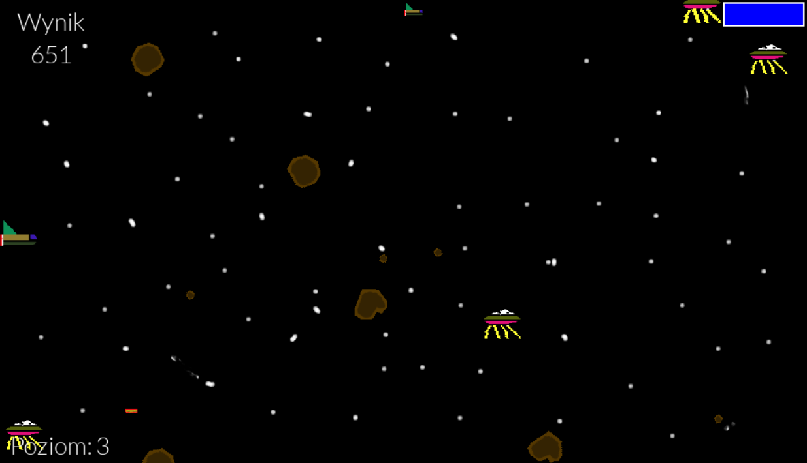

# Space Attack

---

## O Projekcie

**Space Attack** to klasyczna, zręcznościowa strzelanka kosmiczna (typu "shmup") **inspirowana *Gradiusem***. Stworzona w **Pythonie** przy użyciu biblioteki **Pygame**. Jako pilot statku kosmicznego, Twoim zadaniem jest odpieranie niekończących się fal wrogów – od asteroid po wrogie roboty. **Celem gry jest zdobycie jak największej liczby punktów** i przetrwanie jak najdłużej.

---

## Kluczowe Funkcjonalności

* Menu główne
* Wybór jednego z trzech statków
* Muzyka w tle i dźwięki wystrzałów i eksplozji
* System punktacji
* System żyć i osłon
* Sterowanie za pomocą strzałek i stzelanie spacją
* Losowo pojawiający się przeciwnicy
* Zwiększanie co 20 sekund poziomu trudności i od 3 poziomu zaczęcie pojawiania się strzelających przeciwników
* System ulepszeń broni głównej do 3 poziomów. 5% szansy na wypadnięcie ulepszacza z każdego przeciwnika
* Co 20 tys. punktów nowe życie
* System pauzy pod escapem
* Ekran końca gry z możliwością szybkiego restartu rozgrywki

---

## Zastosowane Technologie

* Python 3.x
* Pygame

---
  
